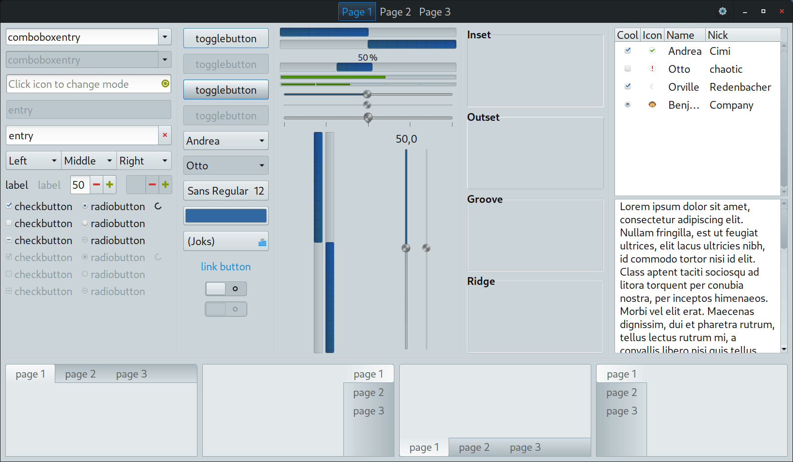
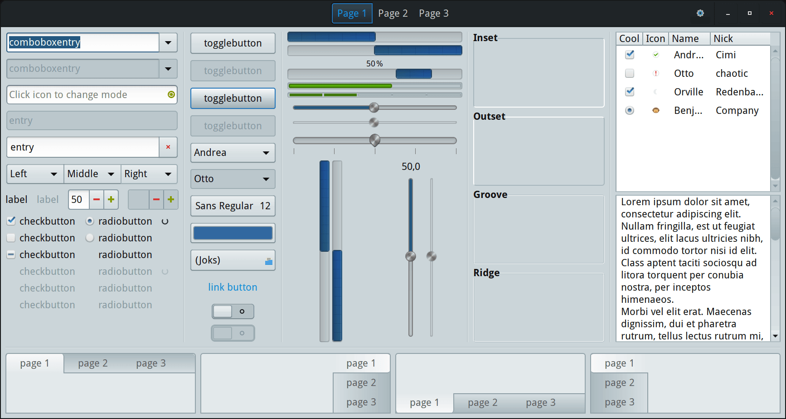

# Blue-Submarine-4k-mod
GTK theme modification for 28 inch 4k monitor.

Linux/BSD Mate desktop GTK theme with ~1.5 larger widgets and spaces between them for 28 inch 4k resolution (DPI/PPI=157) monitor. It should work for other monitors with a similar resolution (DPI/PPI).

Theme works... Also, there are still things to fix and improve.

**Blue Submarine Original (on 28 inch 4k monitor):**


**Blue Submarine theme with ~1.5 larger widgets (on 28 inch 4k monitor):**


## Some tips for theme user

- Set the correct DPI for the fonts according to the PPI of the monitor.
- Increase the Mate panel size (for example to 42 pixels).
- Increase the default size of Caja icons up to 150%.
- Increase icon size in apps menu (use Mate Tweak).
- Increase mouse pointer size.
- Icon themes that have colored toolbar icons are better suited for this theme.
- Increase the size of the Firefox scrollbar:
```
about:config
widget.non-native-theme.scrollbar.size.override
```
- For QT applications install "qt5ct" and "qt5-style-plugins", in QT5 Configuration Tool choose Apperance Style to "gtk2", put in "/etc/environment":
```
   QT_QPA_PLATFORMTHEME=qt5ct
   QT_AUTO_SCREEN_SCALE_FACTOR=0
```
(Tested on Linux Debian 12)
